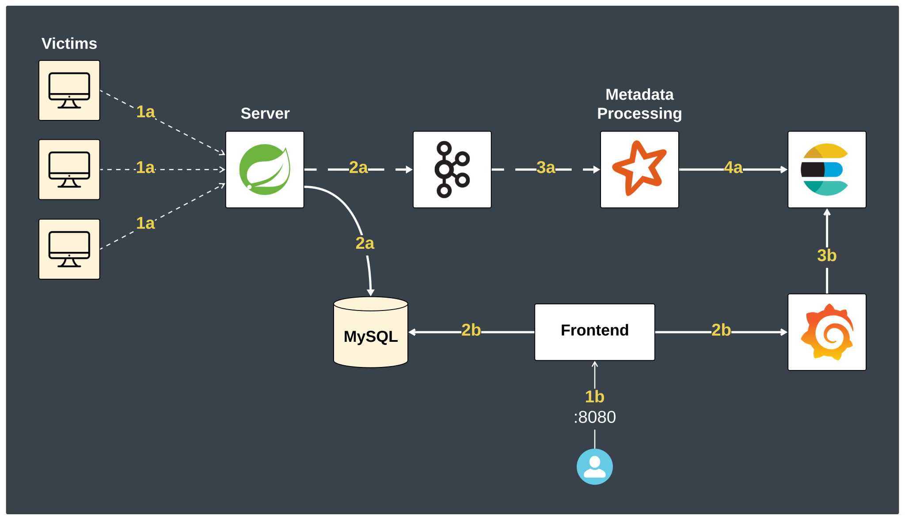
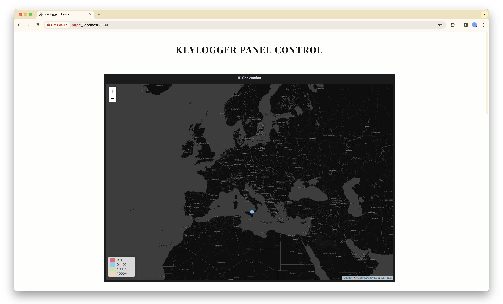
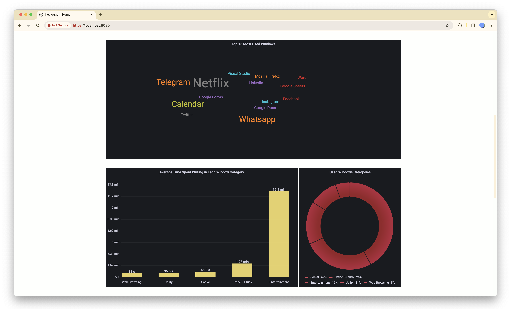
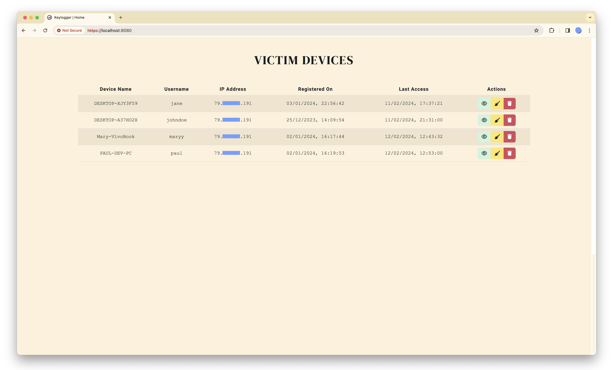
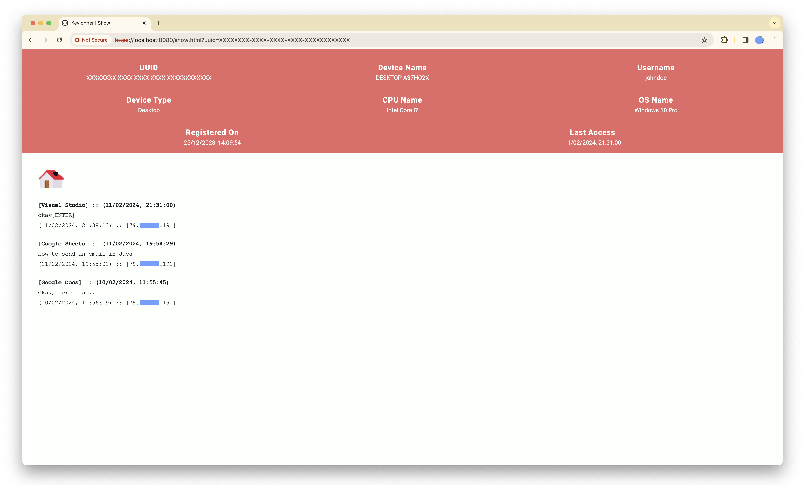

# Systems-Monitor-By-Keylogger
_Project for "Technologies for Advanced Programming" course_<br/>
_Grade: 30 with honors / 30_<br/>
_[Antonio Scardace](https://linktr.ee/antonioscardace)_ @ _Dept of Math and Computer Science, University of Catania_

[](https://www.codefactor.io/repository/github/antonioscardace/systems-monitor-by-keylogger/overview/main)
[](https://github.com/antonioscardace/systems-monitor-by-keylogger/blob/master/LICENSE)
[](https://github.com/antonioscardace/systems-monitor-by-keylogger/issues)

## Introduction

The project is the server system of a distributed keylogger. It aims to make real-time stats about systems where the keylogger is installed.
This keylogger may be a virus installed illegally or a service of the product legally accepted by the user. It is not relevant to this project.

The following functions are provided:
- Show the List of Devices :page_facing_up:
- Show Logs by UUID :page_facing_up:
- Show Device info by UUID :page_facing_up:
- Stats (charts):
   + Victim devices geolocation by IP :earth_americas:
   + Used apps classification (by basic heuristics) :bar_chart:
   + Top 15 most used applications :bar_chart:
   + Different stats about time spent writing to the PC :eyes:
 
## Exam Goals

This project was created as an exam project to test a set of skills, including:
* Knowledge of Docker
* Knowledge of Data Streaming via Apache Kafka
* Knowledge of Data Processing via PySpark Streaming
* Knowledge of Data Storing via ElasticSearch
* Knowledge of Data Visualization via Kibana or Grafana

I also had the opportunity to practice the following skills:
* Knowledge of Java and Spring Boot
* Knowledge of ORMs (Hibernate and Sequelize)
* Knowledge of Node.js and Angular.js
* Use of the Static Analysis Tools (CodeFactor and Sonar Qube)

## System Infrastructure

Each component used in this project is contained in a Docker Container.<br/>
The only reachable containers in the Docker Network are Frontend, Server, Kafka-UI, and Grafana.<br/>
The UML of the internal structure of the server and its database are stored in [/docs/uml/](/docs/uml/).<br/>



- The keylogger must register the device on its first boot via an HTTP request. Then, it can send a log to the server via an HTTP request. You can try both requests [here](/examples/) with dummy data.
- For greater confidentiality and integrity, the value of each `key: value` pair in the JSON request body from the keylogger must be encrypted using **AES128 ECB (PKCS7 padding)** and encoded using **Base64**.

## GUI Demo

<p align="center">
   
   
   
   
</p>

## Getting Started

So that the repository is successfully cloned and the project runs, there are a few prerequisites:

* A stable internet connection.
* A good amount of free space, RAM, and CPU.
* Need to download and install [Docker](https://docs.docker.com/get-docker/).

Then, dependencies can be installed and the project can be run. 

```sh
   $ git clone https://github.com/antonioscardace/Systems-Monitor-By-Keylogger.git
   $ cd YOUR_PATH/Systems-Monitor-By-Keylogger/
   $ bash run.sh
``` 

### Useful Links

| Container | URL | Description |
| --------- | --- | ----------- |
kafka-ui | http://localhost:8800/ | UI for Kafka
grafana-charts | https://localhost:8888/ | Grafana Dashboard
node-ui | https://localhost:8080/ | Frontend (GUI)
